<!-- ════════════════════════════════════════════════════════════════ -->
<!--                            HEADER                                  -->
<!-- ════════════════════════════════════════════════════════════════ -->



<div align="center">

<br/>

<!-- Typing animation -->
<a href="https://portfolio-nu-six-19.vercel.app/">
  
</a>

<br/>

<a href="https://github.com/IDDER29?tab=followers"></a>


</div>


<!-- ════════════════════════════════════════════════════════════════ -->
<!--                            ABOUT                                   -->
<!-- ════════════════════════════════════════════════════════════════ -->

## ⚡ Who I Am

I'm **Idder Ait Elmouden** — a full-stack engineer who builds complete systems.
Not "frontend with some backend experience." The whole thing, at production quality.

I trained at **1337 Coding School (42 Network)** — a peer-only, no-lecture program where ~50% don't
make it through the first month. No teachers. No hand-holding. You either figure it out or you're out.
I figured it out. Then I wrote a `printf`, a shell, and a memory allocator from scratch in C,
got 100% peer-review scores, and came out understanding what's beneath every abstraction I use in web.

That's the difference. Most developers know *how* to use the framework. I know *why* it works.

```typescript
const idder = {
  title:     "Full-Stack Engineer",
  range:     "malloc → production Shopify storefront — every layer",
  school:    "1337 / 42 Network  ·  peer-reviewed  ·  no shortcuts",
  shipped:   ["Arpio Architects", "Social Compass", "Gameplan Redesign", "1337 Systems Suite"],
  stack:     ["TypeScript", "React", "Next.js", "Node.js", "NestJS", "Python", "C", "Shopify"],
  currently: "Deep in C — printf, shell, malloc from scratch. Fundamentals matter.",
  approach:  "I don't write code. I engineer solutions. Then I ship them.",
};
```


<!-- ════════════════════════════════════════════════════════════════ -->
<!--              WHAT MATTERS IN 2026 — NOT LANGUAGES               -->
<!-- ════════════════════════════════════════════════════════════════ -->

## 🧠 What Actually Matters in 2026

> In the age of AI, anyone can generate code. What separates engineers is everything that comes after.

| Capability | What that means in practice |
|---|---|
| 🏗️ **End-to-end ownership** | I take a problem from spec to deployed product. No handoffs. No "that's not my layer." |
| 🔍 **AI-era judgment** | I know when AI output is right, when it's confidently wrong, and how to verify the difference. |
| ⚙️ **Systems depth** | 1337 / 42 Network background — I understand memory, processes, and the layers AI gets wrong. |
| 🛒 **Commerce expertise** | Shopify storefronts built around conversion metrics, not aesthetics. Revenue is the spec. |
| 🚀 **Ship velocity** | From idea to live product, fast. [Check the commit history.](https://github.com/IDDER29?tab=repositories) |
| 🧩 **Architecture thinking** | I design systems that survive real traffic, not just demos. Trade-offs documented, not hidden. |


<!-- ════════════════════════════════════════════════════════════════ -->
<!--                       FEATURED PROJECTS                            -->
<!-- ════════════════════════════════════════════════════════════════ -->

## 🚀 Proof of Work

| Project | What it actually did | Stack |
|---|---|---|
| **[Arpio Architects](https://github.com/IDDER29/arpio-architects-case-study)** ⭐ | Architecture firm website that makes clients trust the firm before they've spoken to anyone. Built to convert, not just to look good. | `React` `TypeScript` `Vite` |
| **[Social Compass](https://github.com/IDDER29/social-compass-mobile)** | A campus super-app that actually shipped — events, ticketing, rewards, community. Real users, real devices, real production. | `React Native` `TypeScript` |
| **[Gameplan Redesign](https://github.com/IDDER29/andy-elliott-gameplan-redesign-case-study)** | Rebuilt a leaking lead-capture page into a conversion funnel that earns its place. Before/after tells the whole story. | `TypeScript` |
| **[1337 Systems Suite](https://github.com/IDDER29?tab=repositories&language=c&sort=stargazers)** | `printf`, shell, memory allocator, core lib — all in C, from scratch, no libraries. 100% peer-review scores. The foundation that separates engineers from developers. | `C` `Makefile` |

> 💡 **68 repositories** — every one of them built, not cloned. [Browse them all →](https://github.com/IDDER29?tab=repositories)


<!-- ════════════════════════════════════════════════════════════════ -->
<!--                         GITHUB STATS                               -->
<!-- ════════════════════════════════════════════════════════════════ -->

## 📊 By the Numbers

<div align="center">


<br/>


<br/>


<br/>


</div>


<!-- ════════════════════════════════════════════════════════════════ -->
<!--                       CONTRIBUTION SNAKE                           -->
<!-- ════════════════════════════════════════════════════════════════ -->

<div align="center">

<picture>
  <source media="(prefers-color-scheme: dark)" srcset="https://raw.githubusercontent.com/IDDER29/IDDER29/output/github-contribution-grid-snake-dark.svg" />
  <source media="(prefers-color-scheme: light)" srcset="https://raw.githubusercontent.com/IDDER29/IDDER29/output/github-contribution-grid-snake.svg" />
  
</picture>

</div>


<!-- ════════════════════════════════════════════════════════════════ -->
<!--                           CONNECT                                  -->
<!-- ════════════════════════════════════════════════════════════════ -->

## 🤝 Work With Me

<div align="center">

**If you need someone who owns the whole stack, sweats the details, and ships —**
**you're looking at the right profile.**

I'm open to freelance contracts and full-time roles where the work actually matters.
Bring me your hardest problem.

<br/><br/>

<a href="https://portfolio-nu-six-19.vercel.app/"></a>
<a href="https://www.linkedin.com/in/idderaitelmouden/"></a>
<a href="mailto:idderaitelmouden@gmail.com"></a>
<a href="https://github.com/IDDER29"></a>

</div>

<br/>

<div align="center">

> *"Most developers use the tools. I understand them — then I build things that last."*


⭐️ From [IDDER29](https://github.com/IDDER29) — built from scratch, as always.

</div>
