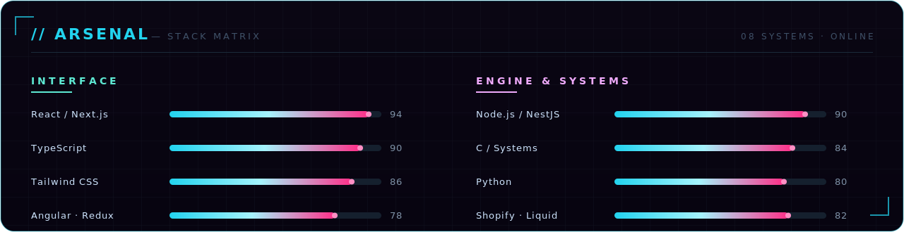

<!-- ┌────────────────────────────────────────────────────────────────┐ -->
<!-- │  Hand-coded profile. Every visual in /assets is a bespoke        │ -->
<!-- │  animated SVG — zero badge services, zero stat-card generators.  │ -->
<!-- └────────────────────────────────────────────────────────────────┘ -->

&nbsp;

&nbsp;

### I build software that feels inevitable.

Full-stack engineer — **systems, web & commerce**. From a `malloc`'d buffer in **C**
to production **React / Next.js** and **Shopify** storefronts. Obsessed with craft,
performance, and the details nobody notices but everybody feels.

📍 Agadir, Morocco · building for the world · open to **freelance** & **full-time**

&nbsp;

&nbsp;

&nbsp;

| ▸ Project | What it is | Stack |
|---|---|---|
| **[Arpio Architects](https://github.com/IDDER29/arpio-architects-case-study)** ⭐ | Premium architecture case study — brand trust, storytelling & conversion-driven UX. | `React` · `TS` · `Vite` |
| **[Social Compass](https://github.com/IDDER29/social-compass-mobile)** | Campus super-app — events, ticketing, reward points & community. | `React Native` · `TS` |
| **[Gameplan Redesign](https://github.com/IDDER29/andy-elliott-gameplan-redesign-case-study)** | A legacy lead-capture page rebuilt into a premium conversion funnel. | `TypeScript` |
| **[1337 Systems Suite](https://github.com/IDDER29?tab=repositories&language=c&sort=stargazers)** | C from scratch — a custom `printf`, a sorting engine, buffered I/O, a core lib. | `C` · `Makefile` |

⌁ &nbsp;**68 repositories** in the wild → [github.com/IDDER29?tab=repositories](https://github.com/IDDER29?tab=repositories)

&nbsp;

&nbsp;

<!-- Live contribution snake — driven by .github/workflows/snake.yml -->
<picture>
  <source media="(prefers-color-scheme: dark)" srcset="https://raw.githubusercontent.com/IDDER29/IDDER29/output/github-contribution-grid-snake-dark.svg" />
  <source media="(prefers-color-scheme: light)" srcset="https://raw.githubusercontent.com/IDDER29/IDDER29/output/github-contribution-grid-snake.svg" />
  
</picture>

&nbsp;
&nbsp;

&nbsp;

Building something that should feel inevitable? Let's talk.

&nbsp;

&nbsp;

&nbsp;

&nbsp;

&nbsp;

  <code>❯ designed &amp; hand-coded from scratch — every pixel.</code>

