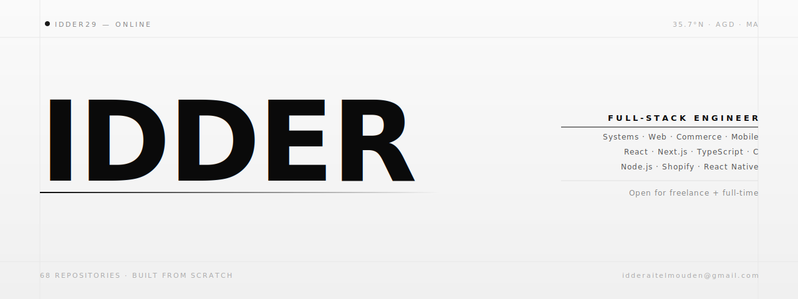

&nbsp;

**Selected Work**

[Arpio Architects](https://github.com/IDDER29/arpio-architects-case-study) — Architecture firm platform. Brand trust and conversion engineering. `React` `TypeScript` `Vite`

[Social Compass](https://github.com/IDDER29/social-compass-mobile) — Campus super-app. Events, ticketing, community. `React Native` `TypeScript`

[1337 Systems Suite](https://github.com/IDDER29?tab=repositories&language=c) — C from first principles. `printf`, shell, sorting, `libft`. `C` `Makefile`

&nbsp;

[Portfolio](https://portfolio-nu-six-19.vercel.app/) &nbsp;·&nbsp; [Email](mailto:idderaitelmouden@gmail.com) &nbsp;·&nbsp; [LinkedIn](https://www.linkedin.com/in/idderaitelmouden/)
